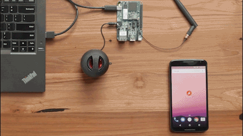
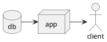
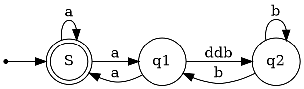
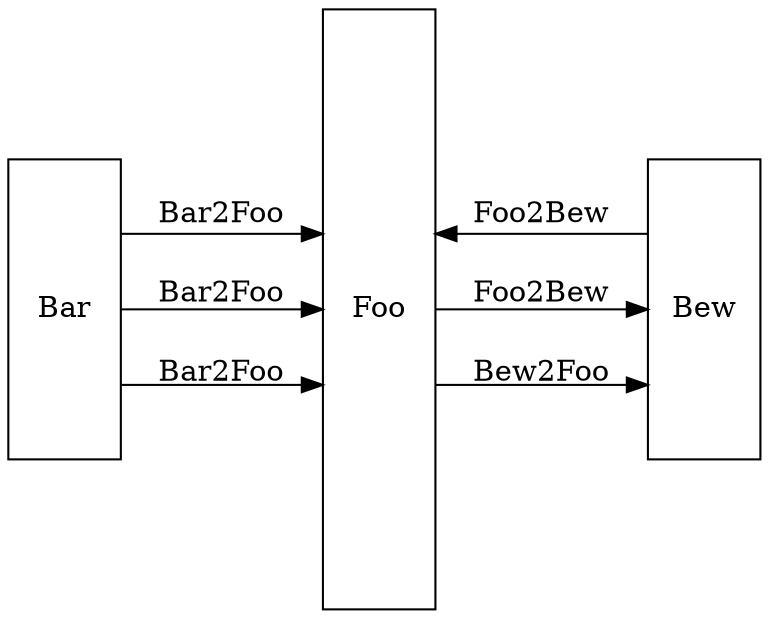
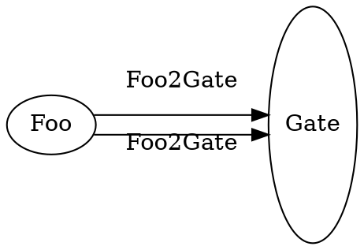

# A Heading

Some Description which explains the topic as an overview.

Bullet points here:
* One
* Two

## Overview done

* Refresh the screen

* an image to insert below 

> An excerpt included in a line here

if no changes needed this will not be an excerpt.

Here is another one

